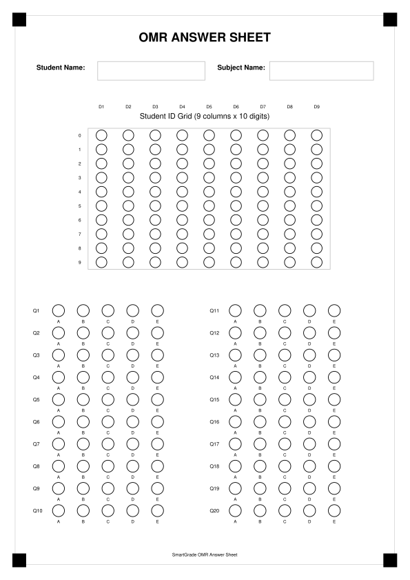

# SmartGrade Scanner

SmartGrade Scanner is an iOS application built with **SwiftUI** for scanning and grading OMR-style answer sheets. It helps teachers capture exam sheets, read student IDs and selected answers, grade exams automatically, review uncertain scans manually, view analytics, and export results as CSV.

The app is designed to work fully on-device. It does not require a backend server or an external database in the current codebase.

---

## Overview

SmartGrade Scanner provides a bilingual Arabic/English interface for managing exams, students, classrooms, OMR templates, scan results, and exam statistics.

The scanning workflow supports images from the document scanner, system camera, or photo library. After an image is selected, the app analyzes the answer sheet, reads the student ID grid, detects marked answer bubbles, grades the sheet against the selected exam answer key, and allows the teacher to review and correct the result before saving it.

---

## Exam Template PDFs and Images

The repository includes printable and visual template assets generated from the same normalized coordinates used in:

```text
SmartGradeScanner/Services/DefaultTemplateFactory.swift
```

These assets are useful for documentation, testing, and printing sample OMR answer sheets.

> Note: The generated PDFs and images are based on the current default template definitions. If you change the template coordinates in code, regenerate these assets using `py docs/templates/generate_templates.py` or `python docs/templates/generate_templates.py`.

### Available Templates

| Template | Printable PDF | Preview Image |
| --- | --- | --- |
| 20-question standard template | [Download PDF](docs/templates/smartgrade-template-20q.pdf) | [Open SVG](docs/templates/smartgrade-template-20q.svg) |
| 50-question standard template | [Download PDF](docs/templates/smartgrade-template-50q.pdf) | [Open SVG](docs/templates/smartgrade-template-50q.svg) |

### 20-Question Template Preview



### 50-Question Template Preview


### Template Layout Details

Both templates include:

- Four black corner markers for page alignment.
- A student ID grid with **9 columns × 10 digits**.
- Multiple-choice answer bubbles for choices **A, B, C, D, E**.
- A page aspect ratio close to A4: `0.707`.

The default student ID prefix in the code is:

```text
320
```

Current default templates:

- `SmartGrade 20-Question Standard Template`
- `SmartGrade 50-Question Standard Template`

---

## Features

- Scan answer sheets using Apple document scanner through `VisionKit`, the system camera, or photo library image selection through `PhotosUI`.
- Read a student ID from an OMR digit grid.
- Detect selected answer bubbles for choices A/B/C/D/E.
- Support default OMR templates for 20-question and 50-question exams.
- Manage exams, students, classrooms, and answer keys.
- Automatically calculate final score, maximum score, percentage, correct answers, wrong answers, empty answers, and multiple-mark answers.
- Manual scan review before saving results.
- Flag uncertain, weak, invalid, or multiple answers for review.
- Match scanned student IDs against registered students.
- View exam analytics, including total scanned students, average percentage, highest score, pass rate, score distribution, and question-level analysis.
- Export exam results as CSV and share them using the iOS share sheet.
- Local sample data seeded on first launch.
- Right-to-left layout support when Arabic mode is active.

---

## Tech Stack

- **Swift 5**
- **SwiftUI**
- **UIKit**
- **VisionKit** for document scanning
- **PhotosUI** for importing images from the photo library
- **Combine** for observable app state
- **CoreGraphics** for image and pixel processing
- **UserDefaults** for local data persistence
- **GitHub Actions** for building an unsigned iOS IPA artifact

The current project does not use external Swift packages.

---

## Requirements

- macOS with Xcode installed
- Xcode version capable of building iOS 17 apps
- iOS 17.0 or later
- iPhone, iPad, or iOS Simulator
- A real iPhone or iPad is recommended for camera and document-scanner testing

Current Xcode project settings:

- Project: `SmartGradeScanner.xcodeproj`
- Scheme: `SmartGradeScanner`
- App display name: `SmartGrade Scanner`
- Bundle identifier: `com.smartgrade.scanner`
- Deployment target: `iOS 17.0`
- Supported devices: iPhone and iPad
- Swift version: `5.0`

---

## Run Locally

1. Open the project in Xcode:

   ```text
   SmartGradeScanner.xcodeproj
   ```

2. Select the scheme:

   ```text
   SmartGradeScanner
   ```

3. Choose a run destination:
   - iOS Simulator for general UI testing.
   - Real iPhone/iPad for camera and document scanner testing.

4. Run the app:

   ```text
   Cmd + R
   ```

---

## Build from the Command Line

Build for the iOS Simulator:

```bash
xcodebuild \
  -project SmartGradeScanner.xcodeproj \
  -scheme SmartGradeScanner \
  -configuration Debug \
  -sdk iphonesimulator \
  build
```

Build an iOS archive without code signing:

```bash
xcodebuild archive \
  -project SmartGradeScanner.xcodeproj \
  -scheme SmartGradeScanner \
  -configuration Release \
  -sdk iphoneos \
  -destination 'generic/platform=iOS' \
  -archivePath build/SmartGradeScanner.xcarchive \
  CODE_SIGNING_ALLOWED=NO \
  CODE_SIGNING_REQUIRED=NO \
  CODE_SIGN_IDENTITY="" \
  DEVELOPMENT_TEAM="" \
  SKIP_INSTALL=NO \
  clean archive
```

---

## Build an Unsigned IPA with GitHub Actions

The repository includes a workflow at:

```text
.github/workflows/build-ios-ipa.yml
```

The workflow runs on `macos-15` and performs the following steps:

1. Checks out the repository.
2. Shows the installed Xcode version.
3. Resolves Swift package dependencies, if any exist.
4. Builds an iOS archive without code signing.
5. Creates an unsigned IPA from the archive.
6. Uploads the generated artifacts.

Generated artifact names:

- `SmartGradeScanner-unsigned-ipa`
- `SmartGradeScanner-xcarchive`

The unsigned IPA is generated at:

```text
build/SmartGradeScanner-unsigned.ipa
```

> Important: The generated IPA is unsigned. It must be signed with a valid Apple certificate/provisioning profile before installation on real devices outside a development workflow.

---

## How to Use the App

1. Open SmartGrade Scanner.
2. Go to the **Exams** tab and create or select an exam.
3. Make sure the exam has the correct answer key and template.
4. Add or review students in the **Students** tab.
5. Add or review classrooms in the **Classes** tab.
6. Go to the **Scan** tab.
7. Select the exam you want to scan for.
8. Capture a document, take a photo, or import an image from the photo library.
9. Run image analysis.
10. Review the scan result: student ID, matched student, selected answers, score, percentage, and answers that need manual review.
11. Save the result.
12. Open the **Statistics** tab to view performance analytics and export CSV results.

---

## Project Structure

```text
SmartGradeScanner/
├── App/
│   └── SmartGradeScannerApp.swift
├── Models/
│   └── OMRModels.swift
├── Resources/
│   └── Assets.xcassets/
├── Services/
│   ├── CameraController.swift
│   ├── DefaultTemplateFactory.swift
│   ├── DocumentScannerService.swift
│   ├── ExportServices.swift
│   ├── GradingService.swift
│   ├── OMRProcessor.swift
│   ├── SampleDataSeeder.swift
│   ├── SmartGradeStore.swift
│   └── StatisticsService.swift
└── Views/
    ├── AnalyticsView.swift
    ├── ClassroomsView.swift
    ├── DesignSystem.swift
    ├── ExamsView.swift
    ├── RootView.swift
    ├── ScannerView.swift
    ├── ScanReviewView.swift
    ├── StudentsView.swift
    └── TemplatesView.swift

docs/
└── templates/
    ├── generate_templates.py
    ├── smartgrade-template-20q.pdf
    ├── smartgrade-template-20q.svg
    ├── smartgrade-template-50q.pdf
    └── smartgrade-template-50q.svg
```

---

## Important Files

- `SmartGradeScanner/App/SmartGradeScannerApp.swift`  
  App entry point. It creates and injects `SmartGradeStore` into the SwiftUI environment.

- `SmartGradeScanner/Models/OMRModels.swift`  
  Contains the main data models for answer choices, OMR results, templates, students, classrooms, exams, and saved results.

- `SmartGradeScanner/Services/SmartGradeStore.swift`  
  Central observable store for app data. It persists templates, classrooms, students, exams, and results using `UserDefaults`.

- `SmartGradeScanner/Services/DefaultTemplateFactory.swift`  
  Defines the default 20-question and 50-question OMR template coordinates.

- `SmartGradeScanner/Services/OMRProcessor.swift`  
  Converts images to grayscale, analyzes image quality, calibrates thresholds, reads student IDs, and classifies answer bubbles.

- `SmartGradeScanner/Services/GradingService.swift`  
  Calculates scores and recalculates results after manual edits.

- `SmartGradeScanner/Services/StatisticsService.swift`  
  Computes score distribution, pass rate, averages, and question-level analytics.

- `SmartGradeScanner/Services/ExportServices.swift`  
  Generates CSV output and presents the iOS share sheet.

- `SmartGradeScanner/Services/DocumentScannerService.swift`  
  Wraps `VNDocumentCameraViewController` and `UIImagePickerController` for SwiftUI.

- `SmartGradeScanner/Views/ScannerView.swift`  
  Main scanning interface.

- `SmartGradeScanner/Views/ScanReviewView.swift`  
  Review screen displayed after processing a scan.

- `docs/templates/generate_templates.py`  
  Generates the PDF and SVG template assets used in this README.

---

## Regenerating Template Assets

If template coordinates are changed in `DefaultTemplateFactory.swift`, regenerate the PDF and SVG files:

```bash
python docs/templates/generate_templates.py
```

or on Windows if using the Python launcher:

```powershell
py docs/templates/generate_templates.py
```

Generated files:

```text
docs/templates/smartgrade-template-20q.pdf
docs/templates/smartgrade-template-20q.svg
docs/templates/smartgrade-template-50q.pdf
docs/templates/smartgrade-template-50q.svg
```

---

## Privacy and Data Storage

- All application data is stored locally on the device using `UserDefaults`.
- The current codebase does not send data to a remote server.
- The app uses camera permission to capture OMR answer sheets.
- The app uses photo library permission to import answer sheet images.

Current permission descriptions in the Xcode project:

- Camera: `SmartGrade uses the camera to capture OMR answer sheets for grading.`
- Photo Library: `SmartGrade uses the photo library to import answer sheet images.`

---

## Troubleshooting

### Camera or document scanner does not work in the simulator

Use a real iPhone or iPad. The iOS Simulator does not fully support all camera and document-scanning features.

### Scan results are inaccurate

Check the following:

- The printed sheet matches the selected template.
- The paper is flat and not heavily rotated.
- The image is sharp and well-lit.
- The answer bubbles are filled clearly with a dark pen.
- There are no heavy shadows over the answer area.

### The result is marked as needing review

The app flags a result when it detects low confidence, weak marks, multiple marks, invalid regions, or poor image quality. Open the review screen and manually confirm the student ID and answers before saving.

### Xcode build fails because of signing

If you are running on a real device, configure a valid Apple Development Team in Xcode. For unsigned CI builds, use the no-signing settings shown in the GitHub Actions workflow.

---

## License

No license file is currently included in this repository. Add a `LICENSE` file if you want to define usage, distribution, or contribution terms.